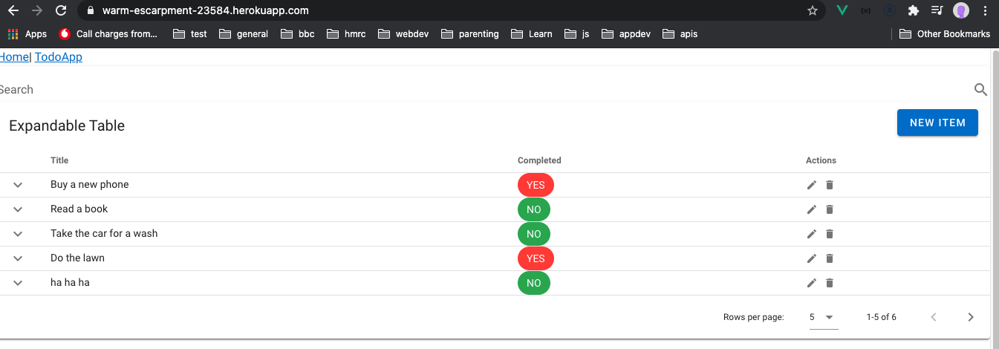
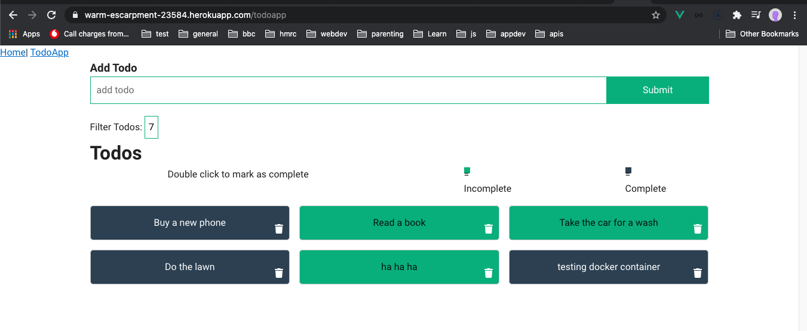
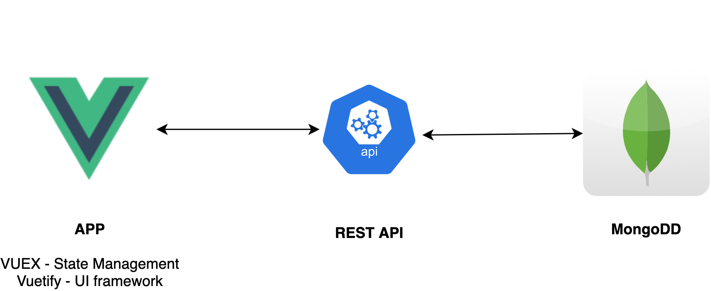

# VueTodoCrud Status - [](https://github.com/johnmorrisQADeveloper/vue_crud_todo_20/actions)


[](.github/workflows/ubuntuElectron.yml) [](.github/workflows/ubuntuChrome.yml)
[](.github/workflows/macChrome.yml)[](.github/workflows/ubuntuFirefox.yml)[](.github/workflows/macEdge.yml). [](.github/workflows/windowsEdge.yml)

https://warm-escarpment-23584.herokuapp.com/





## Project setup
```
npm install
```

### Compiles and hot-reloads for development
```
npm run serve
```

### Compiles and minifies for production
```
npm run build
```

### Lints and fixes files
```
npm run lint
```

### Customize configuration
See [Configuration Reference](https://cli.vuejs.org/config/).
